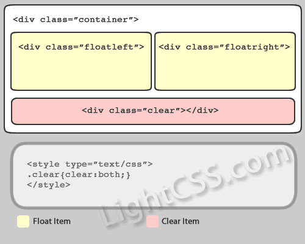

关于CSS中清除浮动的问题
=====
清理浮动的方法
------
###使用带有clear属性的空元素

在浮动元素后使用一个空元素如`

`，并在CSS中赋予.clear{clear:both;}属性即可清理浮动。亦可使用` `或`
`来进行清理。

我想说这并不是一个好方法，尽管它兼容所有浏览器并且随用随清。这个方法需要添加大量无语义的html元素，你能想象一个并不算复杂的footer里就使用4次div.clear吗？天哪！

###使用CSS的:after伪元素

给浮动元素的容器添加一个clearfix的class，然后给这个class添加一个:after伪元素实现元素末尾添加一个看不见的块元素（Block element）清理浮动。这是我认为目前比较完美的解决方式。

如图所见，通过CSS伪元素在容器的内部元素最后添加了一个看不见的空格“/20”或点“.” （后者可理解为一些国外书籍过时的介绍:0）并且赋予clear属性来清除浮动。需要注意的是为了IE6和IE7浏览器，要给clearfix这个class添加一条zoom:1;触发haslayout（你可以把它写到IE6、7的CSS hacker文件里，这样不会影响W3C标准验证）。

该方法需要给每组浮动元素都添加一个容器，推荐在页面布局时使用。大量使用依旧会对代码量造成一些影响。

另外我想说的一点：我倾向于《无懈可击的Web设计II》一书中提到的把.clearfix改为.group，让代码的可读性更好。group说明内部元素为一组，使用clearfix客户会误认为“你写了些神马？竟然用了这么多‘修正’！”。

###使用CSS的overflow属性进行怪异处理

给浮动元素的容器添加overflow:hidden;或overflow:auto;可以怪异清理浮动。

在清理浮动前（如箭头上图），浮动的元素跳离了container层，自己跑到上层去了（用阴影表示）。在添加overflow属性后（如箭头下图），浮动元素又回到了容器层，把容器高度撑起，达到了清理浮动的效果。

虽然很多地方以“将来浏览器可能不兼容”为由，不建议使用此方法。我倒是觉得目前使用此法的国内外网站众多，浏览器短时间内并不会在此问题上后退处理。此外这个方法无需添加额外的class，在做主题时比较实用。我建议在局部和无法添加class的地方使用该方法清理浮动，但是不要作为主要清理浮动方式。overflow:auto;还是不要用了。

###给浮动元素的容器添加浮动

给浮动元素的容器也添加上浮动属性即可清理内部浮动。同overflow法一样无须添加额外的class，使用方便但是会对下面的文档造成影响。

建议在容器原本就浮动或者容器使用了绝对定位时使用该方法。不要在主要布局中使用。

###使用邻接元素清理

什么都不做，给浮动元素后面的元素添加clear属性。

要确保的是content元素跟两个浮动元素都在同一层container容器内，如果content在container元素后面，建议使用:after伪元素清理。

其他方法

使用display:table模拟表格布局也可以解决浮动的问题，并可自动对齐高度。但是由于table的一系列问题，还是不要使用了。

我的解决方案

综合运用方案

在网页主要布局时使用:after伪元素方法并作为主要清理浮动方式；在小模块如ul或textwidget里使用overflow:hidden;（留意可能产生的隐藏溢出元素问题）；如果本身就是浮动元素则可自动清除内部浮动，无需格外处理；正文中使用邻接元素清理之前的浮动。

优点：可以有效降低代码量，使用得当可以完善解决浮动清理问题。
缺点：需要熟悉各种清理方式的原理和利弊，需做好注释，否则对日后维护造成不必要的麻烦。

一劳永逸方案

整站使用相对完美的:after伪元素法清理浮动。本方案适合文档结构清晰、模块化的页面。

优点：使用方便，维护方便，很少出现错误。
缺点：需要清晰的文档结构，否则会造成代码量剧。

小结

通过对各种方法的分析，体现出网页重构时除了要对css应用得当并考虑良好的兼容性，还要培养写良好html文档结构的能力。只有html的结构整洁，模块清晰，才能更好的使用css处理布局中遇到的各种问题。

##为什么overflow：hidden可以清除浮动
BFC：块级排版上下文
1. 用于对块级元素排版，默认情况下只有根元素（body）一个块级上下文，但是如果一个块级元素设置了`float:left`，`overflow:hidden/auto`或`position:absolute`，就会为这个块级元素生成一个独立的块级上下文，就像在window全局作用域内声明了一个function就会生成一个独立的作用域一样，新开辟的BFC像是开辟了一个新的小宇宙，这个块级元素内部的排版完全独立隔绝
2. 独立的块级上下文可以包裹浮动流，全部浮动子元素也不会引起容器高度塌陷，也就是说包含块会把浮动元素的高度也计算在内，所以不用清除浮动来撑起高度

overflow:hidden 的意思是超出的部分要裁切隐藏掉
那么如果 float 的元素不占普通流位置
普通流的包含块要根据内容高度裁切隐藏
如果高度是默认值auto（需要根据height:auto进行hidden）
那么不计算其内浮动元素高度就裁切
就有可能会裁掉float
这是反布局常识的
所以如果没有明确设定容器高情况下
它要计算内容全部高度才能确定在什么位置hidden
浮动的高度就要被计算进去
顺带达成了清理浮动的目标
同理
overflow 非默认值
position 非默认值
float 非默认值等
都是遵循这个布局计算思路

