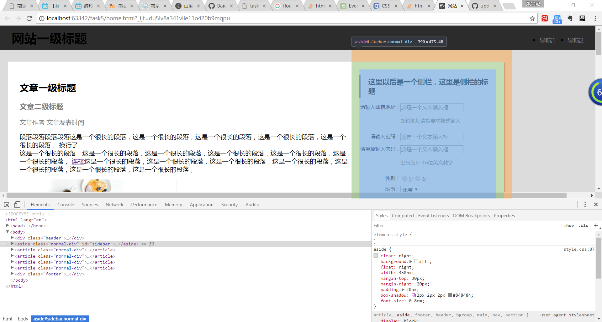
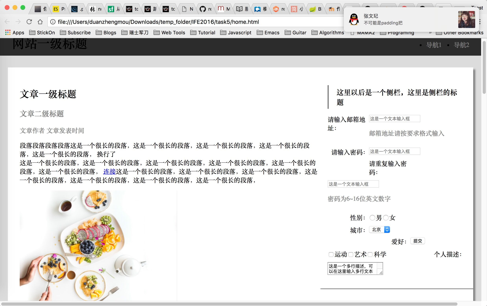

# 字体引发的兼容性问题
@(百度前端技术学院)[task5]
按理说这个任务应该很简单才是，但是自己在做的时候却发现一个很神奇的问题，float侧边栏到页面最右端的时候，这个侧边栏总是距离最右边还有一段距离

百思不得其解，为何如此神奇
把这个界面代码发给同学看了一下，神奇的是他的电脑竟然可以浮动到正确位置，但是侧边栏里的表单格式有些错位

这就很神奇了
分析之后发现表单格式错位是因为label的字体和input的字体line-height不一样，两个元素高度不同，会把下面的float元素顶到后面
这种问题有两种解决方法：
一是把每个label和input都包进一个div里，这样就不会发生上一个div里的label把下一个div的label顶到input的位置的情况了
二是调整label的字体大小

问题就在这里，因为这位同（da）学（lao）电脑的字体和我的字体是不一样的，大小有区别，这里form表单里我的字体恰好可以label和input对齐，而他的不能对齐
同样，因为字体不一样，我的这里右上角的导航也是用float:right做的，而又没有设置header的高度和导航字体的大小，这里就按照浏览器默认的大小设置了，所以这里这个导航的高度就太高而撑出来了，撑到了aside侧边栏的右边，结果aside认为自己的右边还有个导航，就不能抵到浏览器的右边界

也是很坑，以上问题，使用更加兼容的解决方案当然是显式地指定字体大小，但是也可以使用一些css的小技巧来解决
1. 可以显式地指定导航的高度，保证右上角的链接可以放到导航内部，那么这些链接就不会影响下面的侧边栏了
2. 可以给这个侧栏设置clear:right指定其右边不能有任何的float元素，那么当它碰到导航撑出来的高度的时候，就自动换行到导航高度的下一行

竟然连字体不一样都会有兼容性问题。。。
所以教训就是：
1. 一定要善用chrome debug工具，多多尝试修改
2. 导航你可以手动设置字体大小，不用默认的，并且导航相关高度在一定程度上略大，以此来保证在任何环境下都能容纳一定程度的字体大小变动
3. 可以的话尽量不用固定高度和固定宽度，除非确信在大多数情况下它都不会坏事

